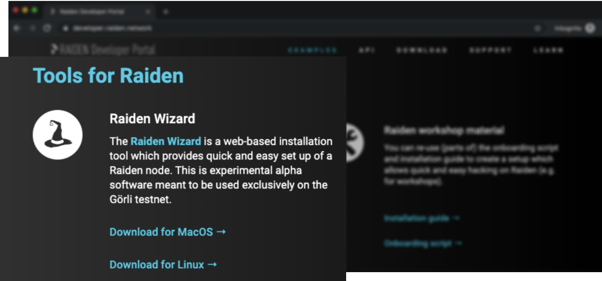
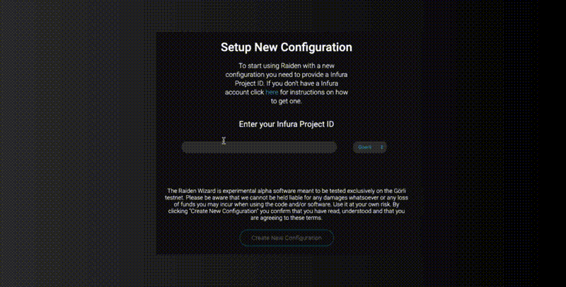

# Install Raiden Using the Wizard

## Download

Visit the [_**Raiden Developer Portal**_](https://developer.raiden.network/) and scroll down to the **"Tools for Raiden"** section, there you will find links for downloading the Raiden Wizard on your system.

## Get Started Immediately

### Prerequisites

* **Infura Project ID**

There is no need for any manual configurations, just provide the Wizard with your Infura Project ID and you're good to go.

If you are familiar with Infura and already have a Project ID feel free to jump ahead to the [_**Installation**_](raiden-wizard.md#installation) section. If not, continue reading for an explanation of what Infura is and how to get a Project ID.


**About Infura**

Infura is a service that runs nodes on the Ethereum blockchain. By using the API endpoints provided by Infura you don't have to worry about syncing the blockchain on your own system, you can simply access all test networks and the Ethereum mainnet through Infura.

The Raiden Wizard sets up a Raiden node on top of Infura and your Project ID works as a way to authenticate your access to Infura.



In this early stage of implementation the Raiden Wizard only supports the Görli testnet.


#### How to Get a Infura Project ID

Getting a Project ID from Infura is free and as easy as 1-2-3.

1. Visit [**infura.io**](https://infura.io/) and click to sign up for a new account or sign in if you already have an account.
2. Once you've accessed your account, click to create a new project and give it a name of your choice.
3. Now, view your project and there you'll find the Project ID under the **KEYS** section.

### Installation

After having downloaded and extracted the Raiden Wizard drag the file to wherever you wish to store it and click to open it. The Wizard will automatically launch in your default browser and from there it literally takes one click to get started using Raiden.

Copy and paste your Infura Project ID into the input field and click **"Create New Configuration"**. The Wizard will start preparing a basic configuration and install the latest version of Raiden. When the set up process is finished it will inform you that Raiden is ready and soon afterwards redirect you to the Web UI on http://localhost:5001.


Installing and launching Raiden can take up to five minutes, be patient and make sure not to close the browser.


**Congratulations! You can now start interacting with Raiden!** 🎉

## !! Add section about using the Wizard as a launcher \(keep it short\)

