# The Raiden Web Application

### Overview

This tutorial will teach you to:

* [Join a token network](the-raiden-web-interface.md#join-a-token-network-1)
* [Make a payment](the-raiden-web-interface.md#make-a-payment)
* [Close channels and settle payments](the-raiden-web-interface.md#close-channels-and-settle-payments)
* Navigate the WebUI

### Join a Token Network

You need to join a token network for the token you're interested in doing payments with. To do so, navigate to the **"Tokens"** screen and there you can choose to either:

* [Join an existing token network](the-raiden-web-interface.md#join-an-existing-token-network)
* [Register a new token and join its network](the-raiden-web-interface.md#register-a-new-token-and-join-its-network)


**What is a token and a token network?**

A token is just a smart contract \(some piece of code that gets executed on the blockchain\). These token contracts follow a certain standard called ERC20 in which a total supply of tokens are defined.

Say that someone owns 10 tokens, it would be the same as saying they're entitled to 10 of the total token supply defined in the contract for the specific token they own.

Another way of viewing tokens is as a registry where different amounts of the total supply are mapped to different owners. Everyone who owns any number of tokens are included in this registry and together they make up a network for the token they own.


#### Join an Existing Token Network

Click the **"JOIN NETWORK"** button next to the token which network you want to join.

Enter the the amount of tokens you want to allocate and click **"Join"**. The amount you choose is what will be available for making payments and you can always [add more funds later](the-raiden-web-interface.md#add-more-tokens).

You're now ready to [make a payment](the-raiden-web-interface.md#make-a-payment)!

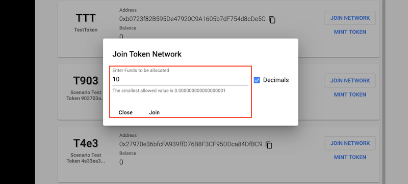

#### Register a New Token and Join Its Network

Click the upper right **"+"** button.

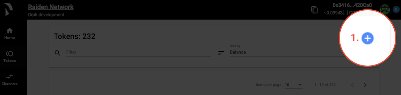

Enter the address of the token you want to register and click **"Register"**.

You're now ready to [make a payment](the-raiden-web-interface.md#make-a-payment)!

### Make a Payment

When you joined a token network three channels were automatically opened with three random nodes and 60% of the tokens you provided got equally distributed with 20% in each channel. The remaining 40% are reserved for when someone wants to open a channel with you.

You now have the possibility to start making payments.

Let's walk through how to:

* [Pay from the tokens screen](the-raiden-web-interface.md#pay-from-the-tokens-screen)
* [Add more tokens](the-raiden-web-interface.md#add-more-tokens)


**What is a channel?**

A channel or payment channel allows Raiden transfers to be made back and forth between parties without involving the actual blockchain.

This works by first creating an initial on-chain deposit with the amount specified when you for instance joined a token network.

The net sum can be used in the Raiden off-chain transactions and the actual blockchain only needs to be involved in the initial setup or when choosing to deposit more tokens or settle a netted amount.

In Raiden channels make up routes between peers. A transfer can be made between two peers that do not have a direct channel with each other as long as there are routes connecting them via other peers.


#### Pay from the Tokens Screen

Click the **"PAY"** button that has now been made available for the token network you've joined.

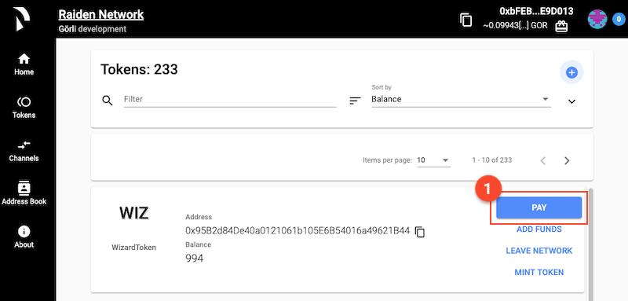

In the popup dialogue:

1. Enter the address of the receiver of your payment.
2. Select the token associate with the token network you're making the payment from.
3. Enter the amount you want to pay.
4. You can choose to fill in any number in the **"Set payment identifier"** dropdown for identifying your payment. If nothing is provided your payment identifier will default to a timestamp.
5. Click **"Send"** to complete your payment.

#### Add More Tokens

You have two ways of allocating more tokens to your channels:

* Click the **"ADD FUNDS"** button in the **"Tokens"** screen next to the token network you want to allocate more tokens for. The number of tokens you provide needs to be higher than the amount currently allocated. Say you already have 10 tokens, your new amount then needs to exceed this number. This is because the sum gets redistributed across your open channels and if you were to provide the same amount there isn't really anything new to redistribute.

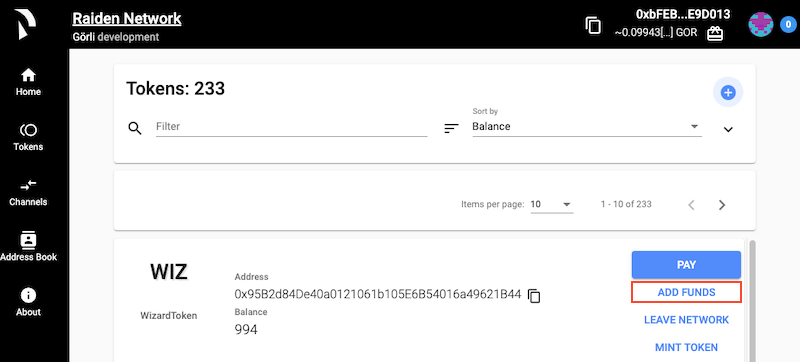

* Click the **"DEPOSIT"** button in the **"Channels"** screen next to the channel you want to deposit more tokens in. This gives you the option to allocate any number of tokens to a specific channel only instead of distributing the amount across all your channels.

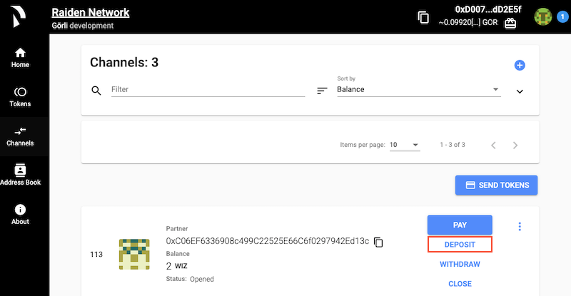

### Close Channels and Settle Payments

You have a couple of ways for depositing tokens back to your token network balance.

* [Withdraw tokens](the-raiden-web-interface.md#withdraw-tokens)
* [Close a channel](the-raiden-web-interface.md#close-a-channel)
* Leave a network

#### Withdraw Tokens

Click the **"WITHDRAW"** button in the **"Channels"** screen next to the channel from wish you would like to make the withdraw. Enter the amount for your withdraw and click **"Confirm"**. The token amount will be added to your total token network balance.

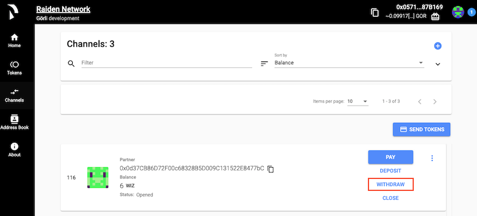

#### Close a Channel

Click the **"CLOSE"** button in the **"Channels"** screen next to the channel you wish to close. When you click **"Confirm"** the channel will get closed and no longer be available for making payments. The token amount will be payed out in accordance to the transactions that have been made between all channel participants.

\*\*\*\*

1. **Leave a network**

   Click the **"LEAVE NETWORK"** button in the **"Tokens"** screen next to the token network you want to leave. Leaving a network does the same as closing a channel with the difference that _all_ channels are closed for the token network you choose to leave.

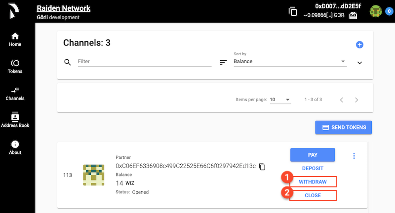

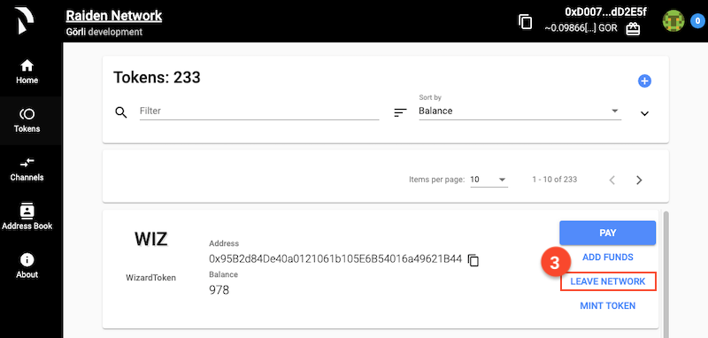

**USE this screen will be empty on the overview of the WebUI page**

The main things you would want to do when using Raiden, let's walk through that flow... Join a Token Network, Make a Payment, Close a Channel and Settle. In the process you will learn what tokens, token networks and channels are

When I re-allocate tokens is any of my ETH consumed because it is syncing the newly allocated amount to the blockchain?

**What is  the use case for providing your own tokens is it for people who build on Raiden? - Need to deploy a smart contract.**

### 

#### 

## **Overview**

This tutorial will teach you to:

* [Navigate the WebUI](the-raiden-web-interface.md#navigate-the-webui)
* Register tokens
* Join a token network
* Make a Raiden payment

### **Navigate the WebUI**

The first screen you'll see when the WebUI launches is the **Home Screen** with a short introduction to Raiden. On the top bar and left hand side you'll find:

1. The address of your Raiden node
2. Navigation for interacting with Raiden. The menu options we will be focusing on are:

* [Tokens](the-raiden-web-interface.md#tokens)
* [Channels](the-raiden-web-interface.md#channels)
* [Address Book](the-raiden-web-interface.md#address-book)

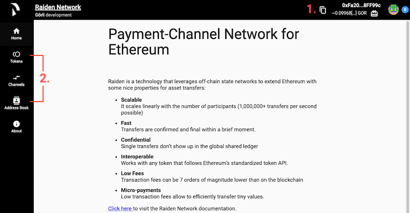

#### **Tokens**

In **Tokens** you'll find:

1. A list of all tokens that have been registered in Raiden
2. Details about each token which includes:
   * The token **Symbol** \(**WIZ** in the example screenshot\)
   * The token **Name** \(**WizardToken** in the example screenshot\)
   * Your current **Balance** of a specific token
   * Buttons where you can **Join Network** or **Mint Token**
3. A **Filter** field where you can search for a registered token by its name or address and a **Sort by** dropdown for sorting your list of tokens
4. A **+** button where you can register tokens

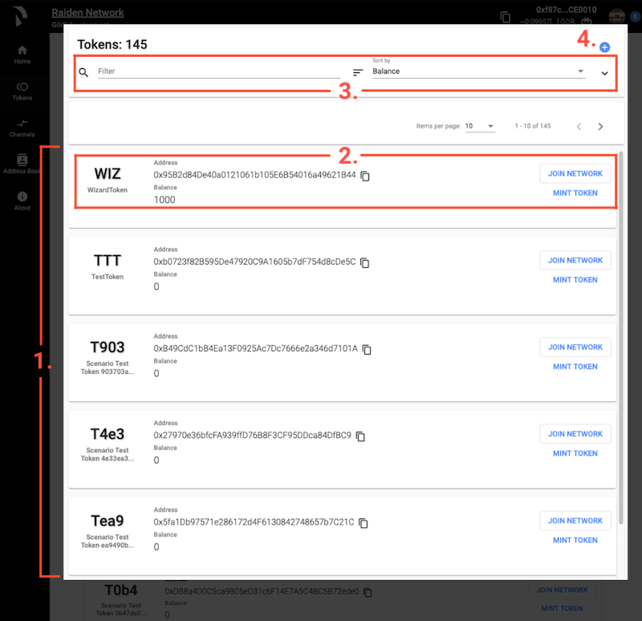


**What is a token and a token network?**


#### Channels

In **Channels** you'll find:

1. A list of all your open channels
2. Details about each open channel which includes:
   * The address of the **Partner** node that you have an open channel with
   * The address of the token when you hover over the token symbol \(**WIZ** in the example screenshot\)
   * The current token **Balance** of your Raiden node for a specific channel
   * Your channels **Status** \(Opened, Closed or Settled\)
   * Buttons where you can **Pay**, **Deposit**, **Withdraw** or **Close** a channel
3. A **Filter** field where you can search for a channel by partner name or address and a **Sort by** dropdown for sorting your list of channels
4. A **+** button where you can open a channel with a counterpart of your choosing


**Add note on initial empty screen**


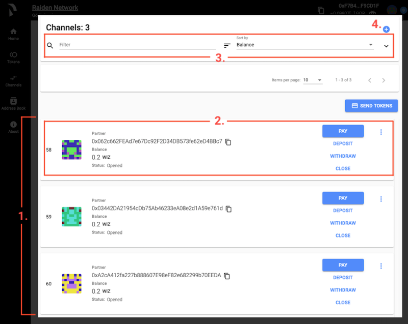


**What is a Channel?**

A channel or payment channel allows Raiden transfers to be made back and forth between parties without involving the actual blockchain.

This works by first creating an initial on-chain deposit of a set amount. The net sum of this amount can then be used in the Raiden off-chain transactions.

We only need to involve the actual blockchain in the initial setup or if we choose to close a channel and settle the netted amount.


#### Address Book

In the **Address Book** you'll find:

1. A list of all your saved addresses
2. Two options for saving new addresses:
   * Type the address and label manually
   * Drag and drop a JSON file containing your addresses

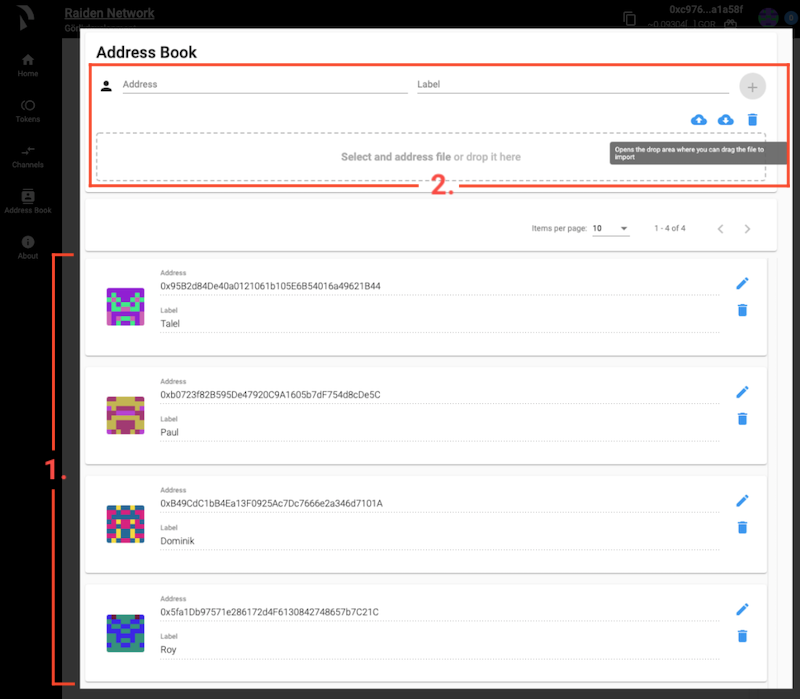

