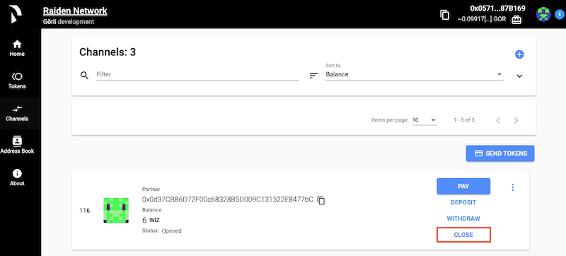

# WebUI

## Run the Raiden Web Application

The easiest way to start using the WebUI is to download and install Raiden by going to



Once you have a Raiden node up and running the WebUI will be available from [http://localhost:5001](http://localhost:5001).

## Join a Token Network

You need to join a token network for the token you're interested in doing payments with. 


**What is a token?** 

A token is defined within a ERC20 compliant smart contract. The token contract is as a registry where different amounts of the total supply are mapped to different owners.

**What is a token network?**

For each ERC-20 compliant token a Raiden Token Network can be registered. All Raiden Nodes registered within this network form a token network.


## Join an Existing Token Network

Click the **"JOIN NETWORK"** button next to the token which network you want to join.


**What is the balance?**

The Token Network Balance shows the on-chain balance of the respective token which the Raiden account holds.


Enter the the amount of tokens you want to allocate and click **"Join"**. The amount you choose is what will be available for making payments and you can always [add more funds later](./#add-more-tokens).

With joining the token network channels have been automatically opened channels to connect you to your peers.


**What is a channel?**

A channel or payment channel allows Raiden transfers to be made back and forth between parties without involving the actual blockchain.



**How does opening a channel works?**

This works by first creating an initial on-chain deposit with the amount specified when you for instance joined a token network.

The net sum can be used in the Raiden off-chain transactions and the actual blockchain only needs to be involved in the initial setup or when choosing to deposit more tokens or settle a netted amount.



**How are channels automatically opened?**

When you joined a token network three channels were automatically opened with three random nodes and 60% of the tokens you provided got equally distributed with 20% in each channel. 

The remaining 40% are reserved for when someone wants to open a channel with you.



**Can I only pay Raiden Nodes where I have got a direct channel to?**

In Raiden channels make up routes between peers. A transfer can be made between two peers that do not have a direct channel with each other as long as there are routes connecting them via other peers.


You're now ready to [make a payment](./#make-a-payment)!

## Pay from the Tokens Screen

You can pay directly from the token screen

Click the **"PAY"** button that has now been made available for the token network you've joined.

In the popup dialogue

1. Enter the address of the receiver of your payment.
2. Select the token associate with the token network you're making the payment from.
3. Enter the amount you want to pay.
4. You can choose to fill in any number in the **"Set payment identifier"** dropdown for identifying your payment. If nothing is provided your payment identifier will default to a timestamp.
5. Click **"Send"** to complete your payment.

## Getting tokens back on-chain

You have a couple of ways for getting tokens back on-chain

* [Withdraw tokens](./#withdraw-tokens)
* [Close a channel](./#close-a-channel)
* [Leave a network](./#leave-a-network)

### Withdraw Tokens

Especially, if you receive tokens, you can get them back on-chain by withdrawing them

Click the **"WITHDRAW"** button in the **"Channels"** screen next to the channel from wish you would like to make the withdraw. Enter the amount for your withdraw and click **"Confirm"**. The token amount will be added to your total token network balance.

### Close a Channel

If you want to get all your tokens back on-chain and don't plan to use the channel any more, you can close it.

Click the **"CLOSE"** button in the **"Channels"** screen next to the channel you wish to close. When you click **"Confirm"** the channel will get closed and no longer be available for making payments. The token amount will be payed out in accordance to the transactions that have been made between the channel participants.

### Leave a Network

If you don't plan to make any more transfers with this token, you can leave the token network.

Click the **"LEAVE NETWORK"** button in the **"Tokens"** screen next to the token network you wish to leave. Leaving a network has the same outcome as [closing an individual channel](./#close-a-channel) with the difference that _all_ channels for the network you're leaving gets closed.

#### 

#### 

